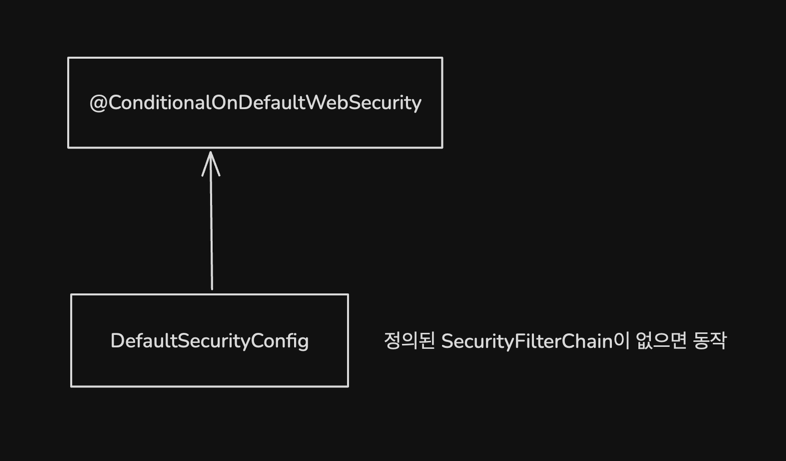
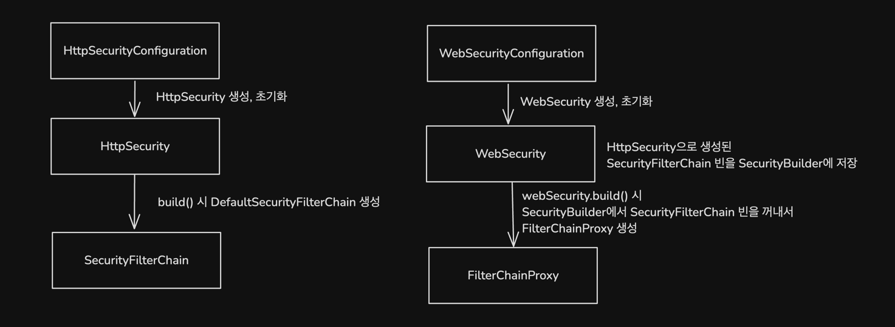
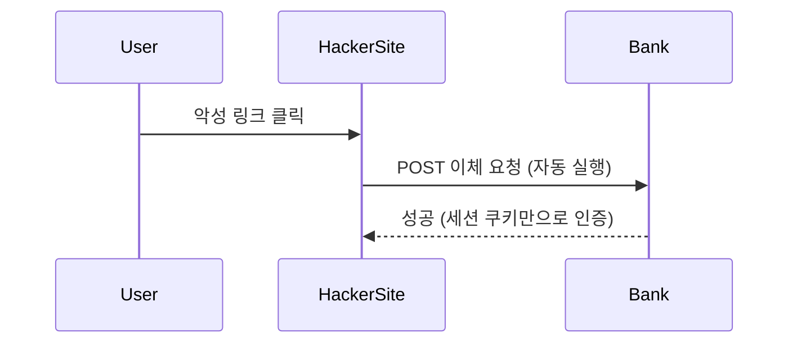
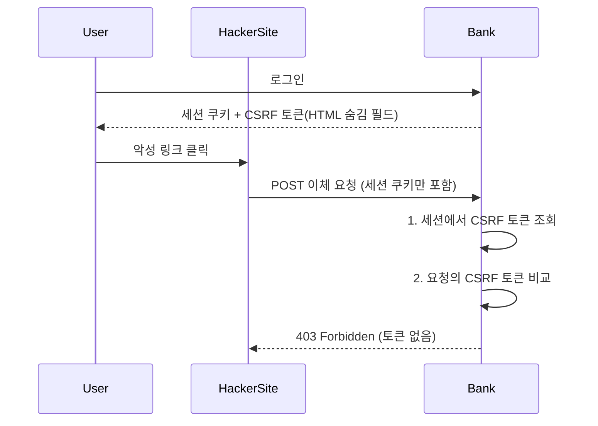

> 미션 4: 취약점 대응 & 리팩토링

<!-- TOC -->
* [요구사항](#요구사항)
  * [실습 - 취약점 대응(CsrfFilter)](#실습---취약점-대응csrffilter)
  * [1단계 - SecurityFilterChain 리팩토링](#1단계---securityfilterchain-리팩토링)
  * [2단계 - 인증 관련 리팩토링](#2단계---인증-관련-리팩토링)
  * [3단계 - 인가 관련 리팩토링](#3단계---인가-관련-리팩토링)
  * [4단계 - Auto Configuration 적용](#4단계---auto-configuration-적용)
    * [미션을 진행하며 생긴 고민에 대한 흔적](#미션을-진행하며-생긴-고민에-대한-흔적)
* [플로우차트를 활용한 이해](#플로우차트를-활용한-이해)
  * [CSRF 공격 대응](#csrf-공격-대응)
    * [CSRF 토큰 적용 전](#csrf-토큰-적용-전)
    * [CSRF 토큰 적용 후](#csrf-토큰-적용-후)
<!-- TOC -->

# 요구사항

## 실습 - 취약점 대응(CsrfFilter)

> CsrfFilter를 이용한 CSRF 공격 대응

- [x] CsrfToken 구현
- [x] CsrfTokenRepository 구현 - HttpSessionCsrfTokenRepository
  - [x] CsrfToken 발급/저장/조회
- [x] CsrfFilter 구현
  - [x] CsrfTokenRepository를 이용한 CsrfToken 검증

## 1단계 - SecurityFilterChain 리팩토링

> 주요 클래스
> - `HttpSecurity`
> - `HttpSecurityConfiguration`
> - `SecurityConfigurer`
> - `Customizer`
> - `@EnableWebSecurity`

- [x] HttpSecurity 구현
- [x] @EnableWebSecurity, HttpSecurityConfiguration를 이용한 HttpSecurity 빈 등록
- [x] csrf 필터를 configurer를 이용하여 설정

## 2단계 - 인증 관련 리팩토링

- [x] `.formLogin()` 메서드를 사용하여 폼 로그인 기능을 설정하고, U`sernamePasswordAuthenticationFilter`를 자동으로 추가한다.
- [x] `.httpBasic()` 메서드를 사용해 HTTP Basic 인증을 설정하고, `BasicAuthenticationFilter`를 자동으로 추가한다.
- [x] `.securityContext()` 메서드를 사용하여 `SecurityContextHolderFilter` 자동으로 추가
- [x] oauth2 리팩토링
  - [x] OAuth2AuthorizationRequestRedirectFilter 등록, OAuth2LoginAuthenticationFilter 등록

## 3단계 - 인가 관련 리팩토링

> 예시 코드

```java

@Bean
public SecurityFilterChain securityFilterChain(HttpSecurity http) throws Exception {
    http
            .authorizeHttpRequests(authorize -> authorize
                    .requestMatchers("/public").permitAll()  // /public 경로는 모두 허용
                    .anyRequest().authenticated())  // 그 외의 경로는 인증 필요
            .formLogin(Customizer.withDefaults())  // 폼 로그인
            .httpBasic(Customizer.withDefaults());  // HTTP Basic 인증

    return http.build();
}
```

- [x] `authorizeHttpRequests()` 메서드 구현
  - [x] `AuthorizeHttpRequestsConfigurer`를 이용한 설정
  - [x] 특정 경로에 대해 인증 없이 접근 가능하도록 설정하고, 나머지 요청에 대해서는 인증이 필요하도록 설정한다.
  - [x] 특정 경로에 대해서 권한에 따라 접근 가능하게 할지/말지를 설정한다

## 4단계 - Auto Configuration 적용

> Auto Configuration을 통한 기본 SecurityFilterChain 설정
> 
> 스프링 부트의 자동 설정을 통해 기본 SecurityFilterChain이 설정되도록 하고, 필요시 사용자가 새로운 SecurityFilterChain을 추가할 수 있도록 한다. 사용자가 새로운 SecurityFilterChain을 정의할 경우, 기본 보안 설정이 비활성화된다.
> 주요 클래스 
> - @ConditionalOnDefaultWebSecurity
> - @DefaultWebSecurityCondition
> - SpringBootWebSecurityConfiguration
> - EnableWebSecurity
> 




- [x] AutoConfiguration을 이용하여 
  - [x] 사용자가 SecurityFilterChain을 정의한 경우 기본 SecurityFilterChain이 설정된다. 
  - [x] 사용자가 SecurityFilterChain을 정의하지 않은 경우 기본 SecurityFilterChain이 설정되지 않는다. 

### 미션을 진행하며 생긴 고민에 대한 흔적 & 피드백 내용

- [x] [CSRF 구현 방식에 대한 고민 (세션, 쿠키 둘 중 어디에 토큰을 저장할지?)](https://github.com/next-step/spring-security-refactoring/pull/9#discussion_r2001099639) 
- [x] [HttpSecurity에서 필터의 순서를 어떻게 제어할지에 대한 고민](https://github.com/next-step/spring-security-refactoring/pull/9#discussion_r2001125969)
  - 👉시큐리티에서는 httpSecurity.addFilter에서 OrderedFilter 생성. 또는 httpSecurity.addFilterAtOffsetOf에서  FilterOrderRegistration을 참조하여 필터 순서를 조정.
- [x] [`AuthorizeHttpRequestsConfigurer::hasRole` 호출 시 roleHierarchy에 대한 의존성을 어떻게 관리할지에 대한 고민](https://github.com/next-step/spring-security-refactoring/pull/9#discussion_r2001147784)
- [x] [AuthorizationFilter에서 인증이 안 되었을 때 401을 던지는 것이 자연스러운가에 대한 고민](https://github.com/next-step/spring-security-refactoring/pull/9#discussion_r2001166948)
- [x] [예외 상황에 따라서 어떻게 예외를 핸들링할지에 대한 고민](https://github.com/next-step/spring-security-refactoring/pull/9#discussion_r2005589776)
- [x] [HttpSecurity를 빈 등록 시 유연성이 떨어지는 문제 고민](https://github.com/next-step/spring-security-refactoring/pull/9#discussion_r2005603658) (구현 완)
- [x] [SecurityConfigurer의 `init`, `configure` 구분을 어떻게 하고 있는지?](https://github.com/next-step/spring-security-refactoring/pull/9#discussion_r2005616627) (구현 완)  


# 플로우차트를 활용한 이해

## CSRF 공격 대응

### CSRF 토큰 적용 전



### CSRF 토큰 적용 후


