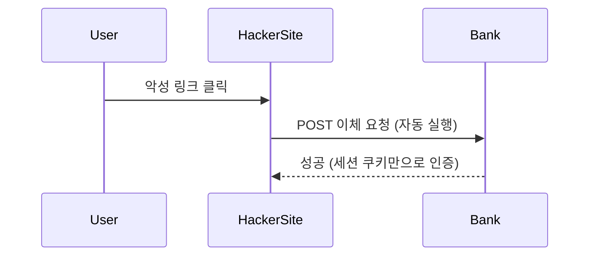
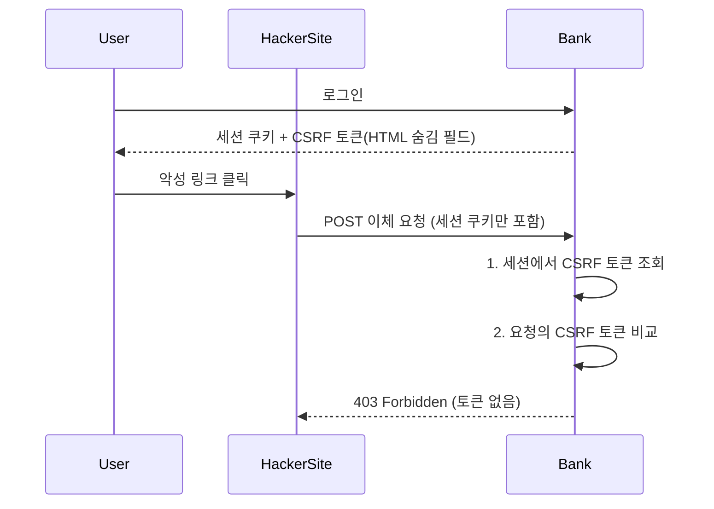

> 미션 4: 취약점 대응 & 리팩토링

# 요구사항

## 실습 - 취약점 대응(CsrfFilter)

>  CsrfFilter를 이용한 CSRF 공격 대응

- [x] CsrfToken 구현
- [x] CsrfTokenRepository 구현 - HttpSessionCsrfTokenRepository
  - [x] CsrfToken 발급/저장/조회
- [x] CsrfFilter 구현
  - [x] CsrfTokenRepository를 이용한 CsrfToken 검증

## 1단계 - SecurityFilterChain 리팩토링

> 주요 클래스
> - `HttpSecurity`
> - `HttpSecurityConfiguration`
> - `SecurityConfigurer`
> - `Customizer`
> - `@EnableWebSecurity`

- [x] HttpSecurity 구현
- [x] @EnableWebSecurity, HttpSecurityConfiguration를 이용한 HttpSecurity 빈 등록
- [x] csrf 필터를 configurer를 이용하여 설정

## 2단계 - 인증 관련 리팩토링

- [ ] `.formLogin()` 메서드를 사용하여 폼 로그인 기능을 설정하고, U`sernamePasswordAuthenticationFilter`를 자동으로 추가한다.
- [ ] `.httpBasic()` 메서드를 사용해 HTTP Basic 인증을 설정하고, `BasicAuthenticationFilter`를 자동으로 추가한다.
- [ ] `securityContext()`는 유저가 직접 설정할 수 없도록 하고, HttpSecurity가 빈으로 등록될 때 자동으로 설정한다. 

## 3단계 - 인가 관련 리팩토링

## 4단계 - Auto Configuration 적용

---

# 플로우차트를 활용한 깊은 이해

## CSRF 공격 대응

### CSRF 토큰 적용 전

### CSRF 토큰 적용 후

